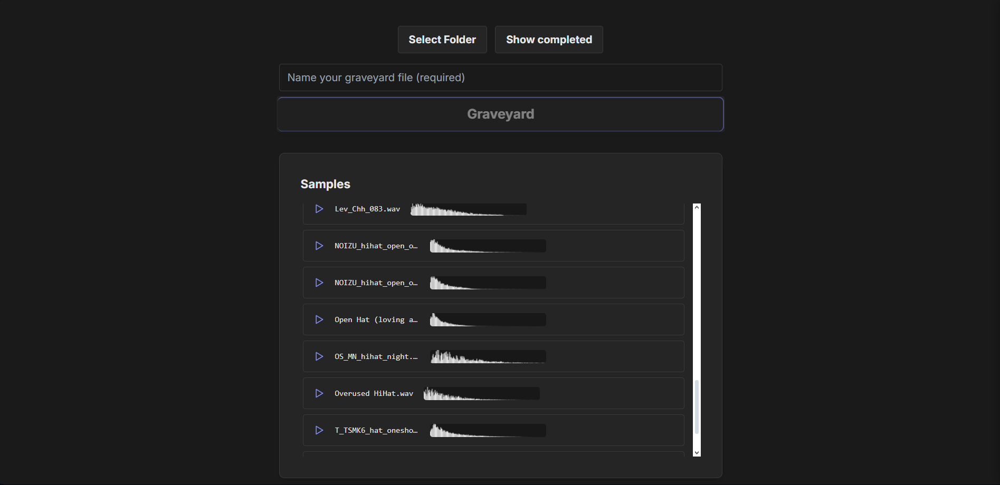
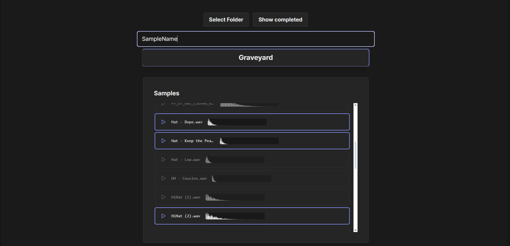
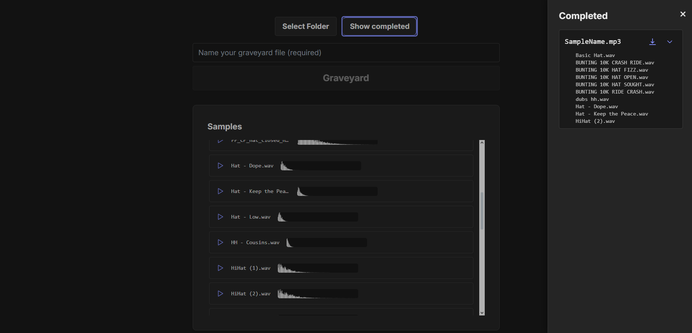
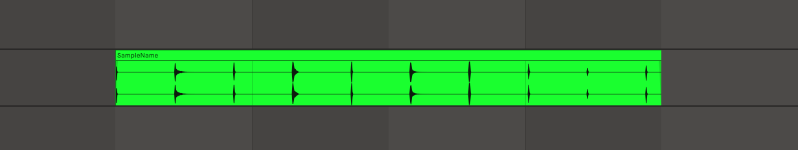
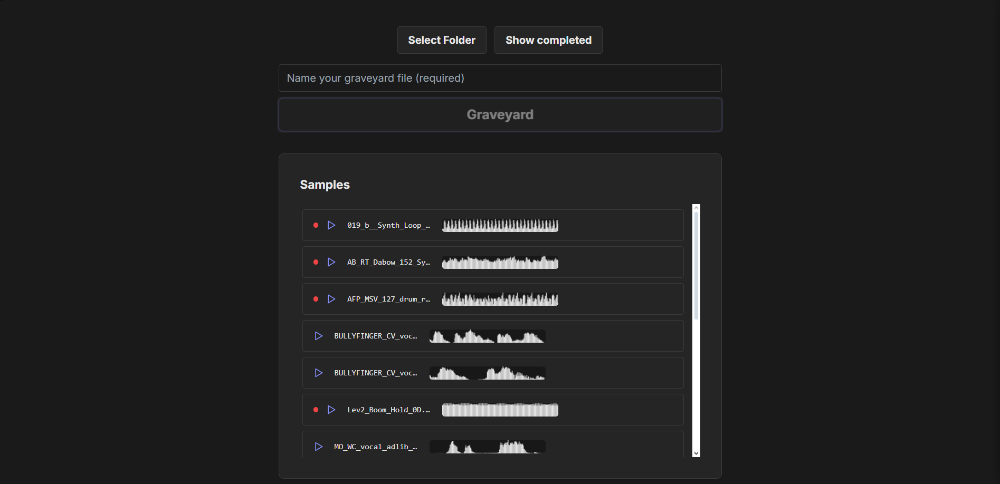

# Sample Graveyard


## Project Purpose

Graveyard is a web application for music producers to easily upload, preview, combine, and manage audio samples. It features a FastAPI backend and a React/Tailwind frontend, providing:

- Drag-and-drop sample upload and waveform preview
- Selection and combination of 2–10 samples, with automatic truncation and spacing
- Visual indicators for long samples and session-based completed jobs
- Sidebar with downloadable completed files and dropdowns showing which samples compose each file

## Demo

- Select a folder of samples on your machine and display them on the file explorer window


- Select up to 10 samples from the file explorer window to add to the graveyard file. Enter a file name and press "Graveyard"



- The samples you selected will be combined into one .wav file with each sample spaced 4 seconds apart


- If you have a sample that is longer than 4 seconds, it will have a red dot next to it on the file explorer. These samples, if selected, will be cut off at 4 seconds for the next sample to begin


## Getting Started

### 1. Clone the Repository

```
git clone https://github.com/dthoshaw/sample_graveyard.git
cd <Path_To_Folder>
```

### 2. Python Backend Setup (FastAPI)

1. Create a virtual environment:
   ```
   python -m venv venv
   ```
2. Activate the virtual environment:
   - **Windows:**
     ```
     venv\Scripts\activate
     ```
   - **Unix/Mac:**
     ```
     source venv/bin/activate
     ```
3. Install dependencies from requirements.txt:
   ```
   pip install -r requirements.txt
   ```

> **Note:** The `.gitignore` file excludes the `venv/` directory from version control.

### 3. Frontend Setup (React + Tailwind)

1. Go to the `react` folder:
   ```sh
   cd react
   ```
2. Install dependencies:
   ```sh
   npm install
   ```

### 4. Running the App

- Use the provided `start.bat` (Windows) or `startMacOS.sh` (Unix/Mac) in the project root to start both backend and frontend.
- The frontend will be available at [http://localhost:3000](http://localhost:3000)
- The backend API will run at [http://localhost:8000](http://localhost:8000)

---

## Folder Structure

```
/ (project root)
  |-- start.bat
  |-- start.sh
  |-- README.md
  |-- venv/ (Python virtual environment)
  |-- main.py (FastAPI backend entry)
  |-- react/ (React frontend)
      |-- package.json
      |-- ...
```

---
